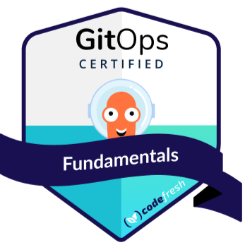
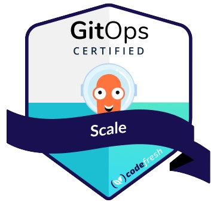

# Resume

* Diego Fernando Luisi

## Personal data

* Brazilian, Married.
* Rua Guilherme Gomes Fernandes, 5A - Amadora/Lisbon - Portugal
* Date of Birth: 12/02/1986
* 📞 +351 910910296 <!-- * 🐧 LPI000249557 -->
* 📨 <contato@diegoluisi.eti.br> | 🌐 <https://www.diegoluisi.eti.br>
* [ LinkedIn](http://www.linkedin.com/in/diegoluisi) | 🎥 [YouTube](https://www.youtube.com/@devxp-tech)  
* [ diegoluisi](https://github.com/diegoluisi/) | [ devxp-tech](https://github.com/devxp-tech/)  

## Professional Expectations 🚀

* Provide resilient solutions in an agile way, which make it possible to optimize processes, have efficient operations, reduce costs, allow rapid expansion and present new options that add value and make them more competitive.

## Summary of qualifications 👨🏼‍💻

* Eager to embrace the DevOps culture and fueled by a passion for Open Source, I bring over 20 years of IT expertise. As the owner of the GitHub Organization [devxp-tech](https://github.com/devxp-tech/), I am committed to fostering collaborative projects. Additionally, my [YouTube](https://www.youtube.com/@devxp-tech) channel serves as a platform for sharing knowledge and providing assistance to the community.

## Academic education 📚

* Nove de Julho University (Uninove)
  * Technology in Computer Networks
  * Sao Paulo-SP
  * Period: 2017
* University of West Paulista (Unoeste)
  * Information systems
  * President Prudente - SP
  * Period: 2004 to 2007 (incomplete)

## Languages 🌎

* English
  * Read / Write - Advanced
  * Conversation - Advanced
* Spanish
  * Reading / Writing - Basic
  * Conversation - intermediate
  
## Certificates and Badges 🏅

<a href="https://www.credly.com/badges/4ad7496c-38ee-43e8-9539-015eae4c8e87/public_url" target="_blank" rel="noreferrer">  <a>
<a href="https://www.credly.com/badges/2c9c4338-7478-44bc-b447-693d55002232/public_url" target="_blank" rel="noreferrer">  <a>
<a href="https://www.credly.com/badges/6e3b0d7d-a46b-4a45-885f-ce7077935c2b/public_url" target="_blank" rel="noreferrer">  <a>

<a href="https://www.credly.com/badges/e3b200e1-f329-4893-85cd-a516e0f50e22/public_url" target="_blank" rel="noreferrer">  <a>
  
<a href="https://www.credly.com/badges/de419523-caf5-47e1-b1ca-24d913ab8037/public_url" target="_blank" rel="noreferrer">  <a>

## Trainings and Workshops 🌱

* [GCP] Google Cloud Fundamentals: Core Infrastructure
* [AWS] AWS Well-Architected Foundations
* [DataDog] Progressive Delivery in Kubernetes
* [DataDog] Monitoring the Kubernetes Platform
* [DataDog] Introduction to Monitoring Kubernetes
* [LFS169] Introduction to GitOps
* [Akuity] Introduction to Continuous Delivery and GitOps using Argo CD
* [Udemy] Certified Kubernetes Administrator (CKA)
* [AWS] Getting Started with DevOps on AWS
* [AWS] Amazon EKS - (40 Hours)
* [AWS] Cloud Practitioner Essentials
* [LFS162x] Introduction to DevOps and Site Reliability Engineering
* [solo.io] Fundamentals for eBPF
* [solo.io] Fundamentals for Cilium
* [codefresh] GitOps at Scale
* [solo.io] Operationalizing Istio [Expert]
* [solo.io] Deploy Istio for Production [Essentials]
* [solo.io] Get Started with Istio [Foundation]
* [codefresh] GitOps Fundamentals
* [AWS] Developing on AWS (AWS SDK, IAM, S3, DynamoDB, SNS, SQS, Lambda, Cognito)
* [DO180] Introduction to Containers, Kubernetes, and Red Hat OpenShift
* [526] DevOps Master (24 hours)
* [4435] JBoss AS 7 Administration with High Performance and Productivity
* [525] Agile infrastructure with Devops practices (Ansible, AWS, Docker, GitLab, Jenkins, Puppet and Rundeck)
* [SUSE-SOC201] OpenStack Administration with SUSE (40 Hours)
* [AIX-AN30] Power Systems for AIX PowerVM (40 Hours)
* [SMGR210] SuSE Manager 3 Administration (24 Hours)
* [CNS-220] Citrix Netscaler Essential CNS-220 – (24 Hours)
* [Instruct] Puppet Fundamentals - (24 Hours)
* [Instruct] Puppet Practitioner – (24 Hours)
* [Instruct] Puppet Introduction – (8 Hours)
* [AIX-AN140BR] AIX Jump Start – (40 Hours)
* [SUSE3126] SuSE Linux Enterprise server 12 (40 Hours)
* SonicWALL – Network Security Basic Administrator (40 hours)
* VMware - Implementing and Managing ESXi and vCenter 5.1 servers – (20 hours)
* [LX0-101/102] Linux – Preparatory course LX0-101/102 (8 weeks)
* [ITIL] - V3 Foundation - (18 hours)
* Zimbra – Collaboration Suite (4 hours)
* Zabbix – Enterprise Open Source Monitoring Solution (4 hours)
* NGINX – High Performance Web Servers (3 hours)
* Mysql – Database Management (3 hours)

## Professional Experiences 👜

### Shield Financial Compliance

* Position: DevOps Engineer
* Lisbon, Lisbon - Portugal 🇵🇹
* 04/2023 - Current
* Follow-up: Financial Compliance
* Role:
  * As a DevOps engineer specializing in Cloud Environments, my role revolves around automating infrastructure with tools like Terraform, Terragrunt, ArgoCD, and Helm. I collaborate with teams to optimize deployment pipelines and architecture scalability. I deploy advanced Kubernetes features like Istio, Keda, and Karpenter for service mesh capabilities and workload optimization. Monitoring with Grafana, Prometheus, Loki, and OpenTelemetry ensures system performance and reliability. Continuous improvement maintains robust, resilient, and scalable environments in AWS and Azure, meeting evolving organizational needs.

### Evolution Gaming

* Position: Site Reliability Engineering (Tech Leader).
* Lisbon, Lisbon - Portugal 🇵🇹
* 04/2022 - 04/2023
* Follow-up: Gaming
* Role:
  * As a Site Reliability Engineering (SRE) Tech Leader, I oversee environment management on Google Cloud Platform (GCP), ensuring reliability, scalability, and efficiency. Using automation tools like ArgoCD, Crossplane, and Helm, I orchestrate seamless bootstrap of new clusters and environments, enabling rapid deployment and consistent infrastructure configuration. Prioritizing observability, I implement monitoring solutions such as Prometheus, Loki, and Grafana, enabling proactive issue identification and resolution. Overseeing our internal developer platform, Backstage, I facilitate collaboration and enhance developer productivity. Through strategic leadership and continuous improvement, I optimize GCP environments to meet organizational performance and reliability requirements.

### Dafiti Group (GFG Group) II

* Position: Site Reliability Engineering/Platform Engineer (Tech Leader).
* São Paulo, SP - Brazil 🇧🇷
* 09/2020 - 04/2022
* Follow-up: e-commerce
* Role:
  * As the Technical Leader of Squad DevXP, I foster a culture of excellence and innovation while driving the adoption of best development practices. With tools like AlertManager, ArgoCD, CircleCI, and GitHub, I orchestrate streamlined workflows and ensure adherence to standards. Leveraging Kubernetes (EKS), Terraform, and Helm, I facilitate efficient infrastructure provisioning and management, empowering the team to deliver quality solutions rapidly. Additionally, I champion observability tools like Grafana, Prometheus, and Loki for proactive monitoring and troubleshooting. Through strategic guidance and mentorship, I cultivate a collaborative environment where team members thrive and contribute to project success.

### C&A Modas do Brasil - II

* Position: DevOps Specialist (Tech Leader).
* Barueri, SP - Brazil 🇧🇷
* 08/2019 - 09/2020
* Follow-up: Retail
* Role:
  * As a DevOps Specialist and Tech Leader, I led the modernization efforts for applications and infrastructure, transforming legacy systems into scalable microservices architectures. Utilizing Docker, OpenShift, and Kubernetes, I embraced containerization to improve portability and scalability, while automation tools like GitLab CI and Puppet streamlined deployment pipelines. Employing ELK stack components for centralized logging and monitoring, including Elasticsearch, Logstash, and Kibana, ensured robust observability. With Terraform and Vagrant, I optimized infrastructure provisioning, orchestrating seamless transitions to cloud environments. Through meticulous planning and execution, I successfully modernized our technology stack, empowering the organization to deliver innovative solutions with agility and reliability.

### Dafiti Group (GFG Group) - I

* Position: Senior / Specialist DevOps Engineer - Tech Leader.
* São Paulo, SP - Brazil 🇧🇷
* 10/2017 - 08/2019
* Follow-up: e-commerce
* Technologies:
  * [AWS, CloudWatch, ELK, Filebeat, Git, Grafana, InfluxDB, Kibana, Kubernetes, Memcached, Metricbeat, NGINX, Puppet, Puppet-Bolt, R10k, Redis, Rundeck, Terraform, Vagrant, Zabbix]

### C&A Modas do Brasil - I

* Position: Senior SysAdmin / DevOps Engineer.
* Barueri, SP - Brazil 🇧🇷
* 08/2014 - 10/2017
* Follow-up: Retail
* Technologies:
  * [AIX, Centrify, Device42, GitLab, GitLabCI, JAVA, Jenkins, MCollective, MacOS Server, Netscaler, OpenScap, Oracle, PowerVM, Puppet, Puppet-DB, Puppet-Explorer, Rundeck, SALT, SuSE Linux, SuSE-Manager, VMware, X-Store, r10k]

### e-Deploy Integrated Technology and Solutions

* Position: Senior SysAdmin / Monitoring Specialist
* Barueri, SP - Brazil 🇧🇷
* 08/2013 - 07/2014
* Follow-up: Technology
* Technologies:
  * [Linux, RedHat, Zabbix, Grafana, MySQL, Sonicwall, Apache, JBoss, VMWare, MySQL]

### Grupo Logos – Logistics and Planned Transport

* Position: Senior SysAdmin
* Barueri, SP - Brazil 🇧🇷
* 01/2012 - 09/2013
* Follow-up: Logistics and Transport
* Technologies:
  * [Active Directory, Apache, Bind9, Fail2Ban, Grafana, GitLab, GitLab CI, MCollective, MySQL, NGINX,Postgrey, Puppet, Puppet-Board, Sonicwal, VMware, Xeams, Zabbix, Zimbra]

### FETAESP - Federation of Agricultural Workers of the State of São Paulo

* Position: SysAdmin
* Agudos, SP - Brazil 🇧🇷
* Duration: 04/2010 to 03/2011
* Follow-up: Union Body.
* Technologies:
  * [Active Directory, Hyper-v, Terminal Service, Sarg, Squid, Squid-Guard, ThinStation, XP Unlimited]

### Santa Alice Group

* Position: SysAdmin
* Presidente Prudente, SP - Brazil 🇧🇷
* Duration: 05/2006 to 09/2008
* Follow-up: Secondary and elementary education institution.
* Technologies:
  * [Active Directory, Iptables, Linux, Microsoft, Squid, Squid-Guard, Sarg]

### e-Future Informatic

* Position: Owner
* Presidente Prudente, SP - Brazil 🇧🇷
* Duration: 04/2002 to 09/2008
* Follow-up: IT Maintenance and Support Company.
* Functions Performed:
  * Support, Design, Installation and Maintenance on Servers and Network.

## Specific knowledge 🥷

### Public Cloud

* Amazon Web Services (AWS):
  * [ACM, ALB, ASG, Athena, CloudFormation, CloudFront, CloudTrail, CloudWatch Logs, Code Deploy, DynamoDB, EBS, ECR, ECS, EC2, EKS, ElastiCache, ELB, GLACIER, IAM, KMS, LAMBDA, RDS, R53, SNS, SQS, S3, VPC]
* Azure:
  * [Virtual Machines, Blob Storage, Kubernetes Service (AKS), SQL Database, Cosmos DB, Service Bus, Data Lake Storage, Functions, App Service, Active Directory (Azure AD)]
* Google Cloud Platform (GCP):
  * [Compute Engine, Cloud Storage, Google Kubernetes Engine (GKE), Cloud Bigtable, Cloud SQL, Cloud Pub/Sub, BigQuery, Cloud Dataflow, Cloud Functions, Google Cloud IAM (Identity and Access Management)]

### The Cloud Native Computing Foundation (CNCF)

* Kubernetes
  * Application Definition & Image Build
    * Backstage, Kustomize, Helm, DevSpace and Okteto
  * Secret Management
    * Cert Manager, Bitnami Sealed Secrets, Hashicorp Vault
  * Continuous Integration & Delivery:
    * ArgoCD AutoPilot, ArgoCD, Argo Events, Argo Workflows and Argo Rollouts
  * Logging and Tracing
    * Kiali, Jaeger, ELK, FluentBit, Promtail, Tempo and OpenTelemetry
  * Monitoring
    * Alert Manager, Prometheus, Grafana and Loki
  * Network Policies
    * Calico, Cilium
  * Scheduling & Orchestration
    * Crossplane
  * Service Mesh
    * Istio and Cilium

### Operation System

* Linux/Unix
  * [Red Hat, SuSE, Debian, CoreOS, HP-UX and IBM-AIX]
* Windows Server/Hyper-V (2000, 2003, 2008, 2012)
  * [AD, DFS, DNS, DHCP, FTP, GPO, IIS, TS, WSUS]

### Tooling

* APM:
  * Datadog, New Relic and Instana.
* AntiSpam:
  * Xeams, Sophos, SpamAssassin.
* Cache:
  * Redis, MemCached.
* CI/CD:
  * ArgoCD, Bamboo, CircleCI, CodeDeploy, GitLab CI, GitHub Actions, Jenkins and Travis.
* Configuration Management:
  * Ansible, Chef, Puppet [PuppetDB, Puppet-Explorer, MCollective, Puppet Bolt, Hiera, eYaml] and Salt.
* Containers:
  * Docker, OpenShift, EKS, Kubernetes, Rancher.
* Data base:
  * Mysql, PostgreSQL, MariaDB, MongoDB and Oracle.
* DNS Server:
  * Bind9.
* File Server:
  * SAMBA.
* Infrastructure as Code:
  * Crossplane, CloudFormation, Terraform and Terragrunt
* ITSM / CMDB:
  * Jira/Confluence, Device42, GLPI, Ocs Inventory and OTRS.
* Log Management:
  * Graylog, ELK and Loki.
* Mail Server:
  * Zimbra, Postfix, Dovecot.
* Middleware:
  * Apache, JBoss, Nginx, Tomcat, Weblogic.
* Monitoring:
  * Prometheus, Nagios, Oracle Enterprise Manager (OEM12) and Zabbix.
* Open Source System Management:
  * Spacewalk, SuSE-Manager, Satellite.
* Proxy Server:
  * Squid, Sarg, SquidGuard.
* Version Control System (VCS):
  * BitBucket, Gitlab and Github.
* VoIP Server:
  * Asterix, Elastix.

### Virtualization

* Hyper-V, IBM PoweVM, KVM, ProxMox and VMWare

### Unified Threat Management (UTM )

* Cisco, Juniper, Netscaler and Sonicwall (CSSA and CSSP Certified)

### Methodologies/Frameworks

* Agile, ITIL, Kanban and Scrum (Fundamentals Certified)
  
<!-- ### Data Storage

* HP 3Pair
* IBM V7000 -->